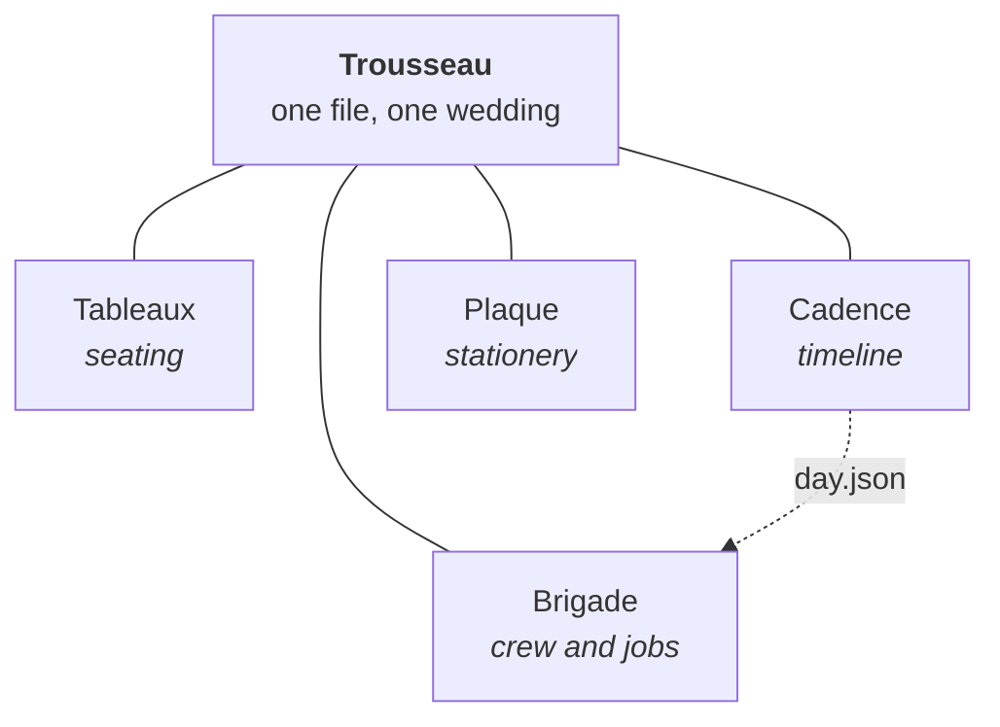

<picture>
  <source media="(prefers-color-scheme: dark)" srcset="https://readme-svg-generator.vercel.app/api/card?label=PROFILE&title=Jacob%20Frusher&subtitle=OSAT%20process%20engineering%20at%20Custom%20Interconnect&theme=dark&width=860" />
  
</picture>

I work in OSAT process engineering at Custom Interconnect, on an industrial placement — the
assembly and test end of semiconductor manufacturing, where the interesting problems are the
ones a yield chart will not explain on its own.

The repositories here are what I build the rest of the time. Most of them exist because
something needed doing and every existing answer was heavier than the problem. A few exist
to find out whether an idea worked, and two of those found out that it did not — which is in
their READMEs, in the results table, rather than quietly left out.

## Now

> [!NOTE]
> On placement at Custom Interconnect. Outside it, the wedding toolchain further down is
> being finished against a date that does not move, which makes it the only project here
> with a deadline anyone else can see.

<!-- NOW:START -->
| Repository | Last push | Latest commit |
| --- | --- | --- |
| [readme-svg-generator](https://github.com/JFrusher/readme-svg-generator) | 25 Aug 2026 | Refine button styling in SVG helper for better visibility |
| [Trousseau](https://github.com/JFrusher/Trousseau) | 25 Aug 2026 | Make sync's dry run read-only, and stop the shell mangling commit... |
| [cadence](https://github.com/JFrusher/cadence) | 24 Aug 2026 | feat: add timeline export functionality and moment handling |
<!-- NOW:END -->

## Tools

Small, single-purpose, and finished rather than perpetually in progress.

<picture>
  <source media="(prefers-color-scheme: dark)" srcset="https://readme-svg-generator.vercel.app/api/repo?repo=JFrusher/readme-svg-generator&theme=dark&width=425" />
  
</picture>
<picture>
  <source media="(prefers-color-scheme: dark)" srcset="https://readme-svg-generator.vercel.app/api/repo?repo=JFrusher/Plaque&theme=dark&width=425" />
  
</picture>
<picture>
  <source media="(prefers-color-scheme: dark)" srcset="https://readme-svg-generator.vercel.app/api/repo?repo=JFrusher/cadence&theme=dark&width=425" />
  
</picture>

- **[readme-svg-generator](https://github.com/JFrusher/readme-svg-generator)** — every card
  on this page comes from it. Most README card services screenshot HTML with a headless
  browser; an SVG is a string, so this one assembles the document from template literals and
  installs zero packages. Six card types, six themes, and a cold start measured in
  milliseconds.
- **[Plaque](https://github.com/JFrusher/Plaque)** — a guest CSV goes in, print-ready place
  card PDFs come out, and nothing leaves the browser. Vector text that stays selectable,
  tent cards printed to read from across the table, and names that never quietly become
  illegible: they shrink, wrap, or tell you which guests are a problem.
- **[Cadence](https://github.com/JFrusher/cadence)** — the run of a wedding day. Anchored
  blocks that will not move, floating blocks that follow, and a clash list when the two
  disagree. It works out when the light goes from the venue's coordinates and the day's UTC
  offset — no network, no timezone database — then says so when the portraits have drifted
  past it.

## Research

Benches built to answer one question, and to publish the answer even when it is no.

<picture>
  <source media="(prefers-color-scheme: dark)" srcset="https://readme-svg-generator.vercel.app/api/repo?repo=JFrusher/poly-compress&theme=dark&width=425" />
  
</picture>
<picture>
  <source media="(prefers-color-scheme: dark)" srcset="https://readme-svg-generator.vercel.app/api/repo?repo=JFrusher/CathSim&theme=dark&width=425" />
  
</picture>
<picture>
  <source media="(prefers-color-scheme: dark)" srcset="https://readme-svg-generator.vercel.app/api/repo?repo=JFrusher/RADL&theme=dark&width=425" />
  
</picture>

- **[poly-compress](https://github.com/JFrusher/poly-compress)** — can algebraic
  representation compete with entropy coding? No, and the bench now measures the whole
  design space that proves it: from the original Chebyshev codec at 35.8 bits per character
  down to a pure-Python PPM at 2.062 bpc, which beats `bz2`.
- **[CathSim](https://github.com/JFrusher/CathSim)** — a 2D endovascular catheter trainer
  where every force comes from a documented closed-form relation, and every number that
  could have been tuned by taste is traceable to a citation instead. Fluoroscopy bills to a
  dose ledger, because working off the held image is the habit being trained.
- **[RADL](https://github.com/JFrusher/RADL)** — cricket has Cricsheet and football has
  StatsBomb open-data; rugby union has nothing. A schema and a converter for the corpus that
  does not exist yet. Still a v0.3 draft with no real match traced, which is exactly why the
  conventions are still cheap to change.

<b>Five repositories, one wedding</b>

 

Four apps own different parts of the same day. Seating lives in one, the running order in
another, the crew in a third, the place cards in a fourth. Every one of them can export a
file, and none of them agrees with the others for long — which you find out at the worst
possible moment, when the place cards say table 6 and the seating plan says table 8. Two of
them once disagreed about what day the wedding was on.

Trousseau is the file they all agree on, plus the validation that runs before any of it is
kept. Git carries the pointers and a private remote carries the bytes, because these repos
are public and the data has real people's email addresses in it.

| | |
| --- | --- |
| [Trousseau](https://github.com/JFrusher/Trousseau) | The schema, the collector, the checks, and the version history of every state the wedding has been in |
| [Tableaux](https://github.com/JFrusher/Tableaux) | A to-scale room, tables dragged onto a canvas, guests assigned to tables or to individual seats |
| [Cadence](https://github.com/JFrusher/cadence) | The timeline, the clashes, and five printed pieces of paper |
| [Brigade](https://github.com/JFrusher/Brigade) | The jobs hanging off Cadence's blocks, and the people doing them |
| [Plaque](https://github.com/JFrusher/Plaque) | The place cards, imposed onto sheets that waste the least card stock |

Shared design language, no shared code. Built for our own wedding, which is the only reason
the constraints are honest: real guest names, four apps that must not overwrite each other,
two laptops, and a date that does not move.

## The numbers

<picture>
  <source media="(prefers-color-scheme: dark)" srcset="https://readme-svg-generator.vercel.app/api/stats?username=JFrusher&exclude_langs=Jupyter%20Notebook&theme=dark&width=425" />
  
</picture>
<picture>
  <source media="(prefers-color-scheme: dark)" srcset="https://readme-svg-generator.vercel.app/api/stack?title=STACK&categories=Languages,Building,Domains&Languages=Python,TypeScript,JavaScript,C%2B%2B,MATLAB&Building=Node,Vite,Vitest,Docker,GitHub%20Actions&Domains=Signals,Control,Simulation,Compression&theme=dark&width=425" />
  
</picture>

<picture>
  <source media="(prefers-color-scheme: dark)" srcset="https://readme-svg-generator.vercel.app/api/heatmap?username=JFrusher&theme=dark&width=860" />
  
</picture>

The language split weights every repository equally rather than by bytes, and leaves Jupyter
notebooks out of it. A notebook stores its output images base64-encoded inside the file, so
twenty of them will happily outweigh eighteen repositories of hand-written source. By bytes
I write 96.7% Jupyter, which is not true in any useful sense.

## Recent activity

<!-- ACTIVITY:START -->
- **25 Aug 2026** - pushed to [readme-svg-generator](https://github.com/JFrusher/readme-svg-generator) - Add playground support for six cards, presets and shareable state
- **25 Aug 2026** - pushed to [Trousseau](https://github.com/JFrusher/Trousseau) - Make sync's dry run read-only, and stop the shell mangling commit...
- **25 Aug 2026** - merged [Trousseau#1](https://github.com/JFrusher/Trousseau/pull/1) - Readme tone
- **24 Aug 2026** - pushed to [cadence](https://github.com/JFrusher/cadence) - Ignore .remember/, which holds session transcripts with real names
- **24 Aug 2026** - pushed to [Brigade](https://github.com/JFrusher/Brigade) - Ignore .remember/, which holds session transcripts with real names
<!-- ACTIVITY:END -->

<b>Everything else</b>

 

| Repository | |
| --- | --- |
| [EMG](https://github.com/JFrusher/EMG) | Muscle signal to moving gripper, with the whole filter chain on screen so the processing is visible rather than asserted. Runs with no hardware attached |
| [Lunar-Lander](https://github.com/JFrusher/Lunar-Lander) | Classical control against PPO on `LunarLander-v3`. A 0.1 per-step time penalty buys 22% faster landings at no measurable cost to reward, three seeds per point |
| [phase-trace](https://github.com/Jfrusher/phase-trace) | Trace a rugby possession with the mouse in one unbroken line; the recogniser reads carries, passes and kicks out of the shape of it, and a sport-agnostic engine draws the momentum chart |
| [MAINTAIN](https://github.com/JFrusher/MAINTAIN) | Zero-keyboard maintenance logging for a cleanroom production floor. Operator auth is a badge scan, not a password |
| [PBPK-ABM-thesis](https://github.com/JFrusher/PBPK-ABM-thesis) | Dissertation work: an agent-based tumour model coupled to physiologically based pharmacokinetics |
| [MALLI](https://github.com/JFrusher/MALLI) | Malaria detection classifier with a Flutter front end |
| [Medtech](https://github.com/JFrusher/Medtech) | Anaesthesia infusion optimisation over a PK/PD model |
| [DCE-Workshops](https://github.com/JFrusher/DCE-Workshops) · [DCE-code-workshops](https://github.com/JFrusher/DCE-code-workshops) | Data-Centric Engineering workshop material, and the participant notebooks that go with it |

## Elsewhere

[jfrusher.github.io](https://jfrusher.github.io) ·
[LinkedIn](https://www.linkedin.com/in/jacob-frusher-44333124b/) ·
[jacob@frusher.co.uk](mailto:jacob@frusher.co.uk)

<b>How this page stays current</b>

 

Every card above is a live SVG from
[readme-svg-generator](https://github.com/JFrusher/readme-svg-generator), rendered on request
against the GitHub API and cached for four hours. The stars, descriptions and topics on the
repository cards are whatever they are right now — there is no copy of them in this file to
go stale. Each card is wrapped in a `<picture>` so it follows your colour scheme rather than
mine.

The **Now** and **Recent activity** blocks are rewritten every night by
[a workflow](.github/workflows/refresh-readme.yml) running
[one dependency-free script](scripts/update-readme.mjs). It commits only when the content
actually changed: dates are absolute rather than relative, precisely so that a quiet week
produces no commits at all instead of a week of bot noise in the heatmap two sections up. If
the API is unreachable the script exits non-zero without writing, which leaves yesterday's
correct content in place and turns the run red.

One known edge: GitHub disables scheduled workflows after 60 days with no repository
activity, and the bot's own commits do not reset that clock. If this page ever stops moving,
that is where to look.

